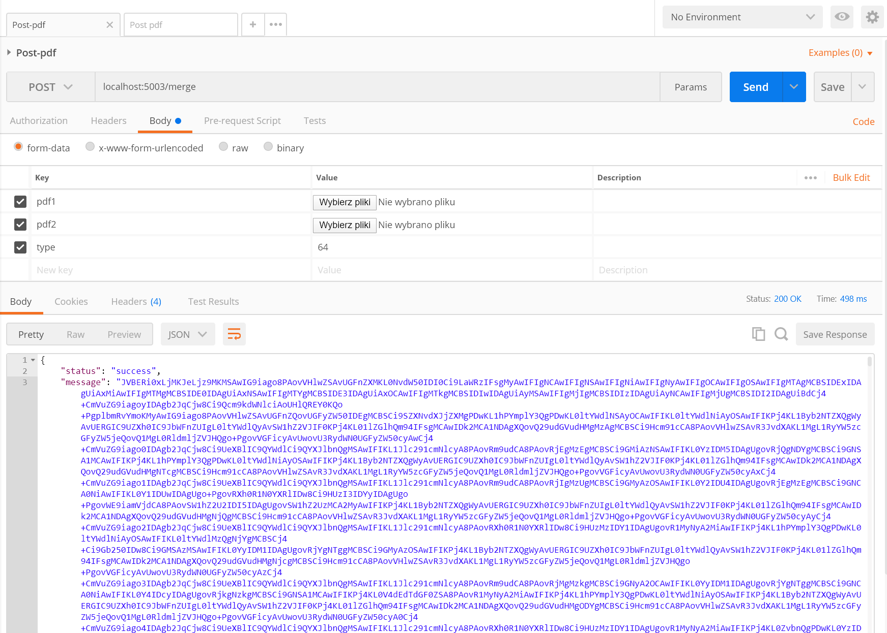

# PDF-Merge

Api using PyPDF4 to merge 2 pdfs into one. Return pdf base64 encoded or through browser's "Save File" window.

Requirements:
  - flask 1.1.2
  - flask_restful 0.3.8
  - PyPDF4 1.27.0

## Sample POST request - Postman
